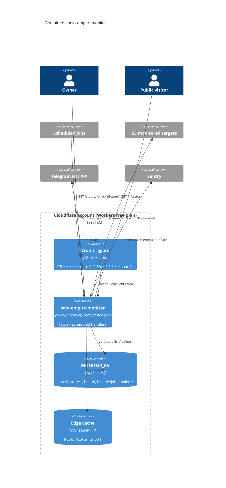

# 06 — C4 Container

```mermaid
C4Container
    title Containers: solo-empire-monitor
    Person(owner, "Owner")
    Person(visitor, "Public visitor")
    System_Ext(jobs, "Scheduled jobs")
    System_Ext(targets, "65 monitored targets")
    System_Ext(telegram, "Telegram Bot API")
    System_Ext(sentry, "Sentry")

    System_Boundary(cf, "Cloudflare account (Workers free plan)") {
        Container(cron, "Cron triggers", "Workers cron", "*/5 * * * * = shard 0, 2-59/5 * * * * = shard 1")
        Container(worker, "solo-empire-monitor", "TypeScript Worker, compat nodejs_als", "fetch + scheduled handlers")
        ContainerDb(kv, "MONITOR_KV", "Workers KV", "state:0, state:1, hb:job, hbstale:job, hbalert:*")
        ContainerDb(cache, "Edge cache", "caches.default", "Public /status for 60 s")
    }

    Rel(cron, worker, "scheduled(event.cron)")
    Rel(visitor, worker, "GET /, /status")
    Rel(owner, worker, "GET /status, /check (Bearer)")
    Rel(jobs, worker, "POST /heartbeat/job (Bearer)")
    Rel(worker, kv, "get / put / list / delete")
    Rel(worker, cache, "match / put")
    Rel(worker, targets, "GET with 10 s timeout")
    Rel(worker, telegram, "sendMessage")
    Rel(worker, sentry, "errors via @sentry/cloudflare")
```

Sources: `wrangler.toml`, `src/worker.ts`, `src/sentry.ts`, `package.json`
